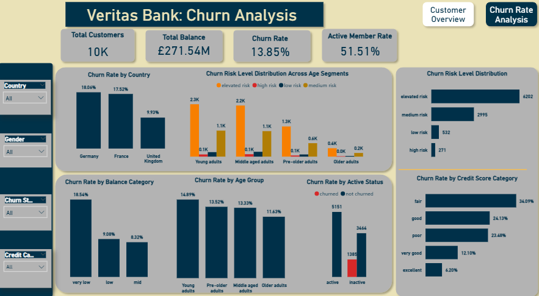

# Veritas Bank: Customer Churn and Retention Analysis

  

###  [Live Churn Dashboard Link](https://veritasbank-churn-dashboard.streamlit.app/)

---

## Business Overview
Established in the 1990s, **Veritas Bank** has grown to serve over 3 million users across the UK, Germany, and France. Despite its strong technological foundation, the bank is facing increased customer attrition. 

### Key Challenges:
* **Market Competition:** Rising pressure from neobanks and fintech startups.
* **Regional Engagement:** Noticeable churn spikes within the German and French markets.
* **Monitoring Gaps:** Absence of real-time churn tracking and data-driven retention strategies.

---

## Project Focus and Scope
The goal of this project is to quantify risk profiles and identify common characteristics among customers who have exited the bank.

### The Four-Phase Analytical Approach:
1. **Database Design:** Setting up SQL Server and performing rigorous data quality checks.
2. **Feature Engineering:** Creating derived columns (Age Groups, Credit Categories) for deeper analysis.
3. **Power BI Modeling:** Connecting to SQL to visualize demographics and churn metrics via DAX.
4. **Strategic Reporting:** Summarizing insights to guide marketing and service policies.

### Technology Stack
* **Database:** Microsoft SQL Server (Data processing & transformation)
* **Visualization:** Microsoft Power BI (Interactive dashboarding & DAX)
* **Documentation:** Microsoft PowerPoint (Executive summaries)

---

## Analytical Insights
Based on the analysis of 10,000 customers, the following key drivers for churn were identified:

### 1. Demographic Risk Factors
| Metric | High-Risk Segment | Insight |
| :--- | :--- | :--- |
| **Geography** | Germany & France | Churn rates of 18.06% and 17.52% vs. only 9.93% in the UK. |
| **Age** | Young Adults | This group exhibits the highest churn rate at 14.89%. |
| **Credit Score** | "Fair" Category | Accounts for the largest portion of churned customers (34.09%). |

### 2. Behavioral Insights
* **Inactivity:** There is a massive correlation between inactivity and churn; inactive members are significantly more likely to exit (1,385) than active ones (510).
* **Product Depth:** Customers holding only one product ("Low Engagement") represent the highest risk group.
* **Account Balances:** The "Very Low" balance segment has the highest churn rate at 18.54%.

---

## Strategic Recommendations
* **Regional Optimization:** Implement targeted retention campaigns specifically for the German and French markets.
* **Activity Drivers:** Develop incentives to transition inactive members to "Active" status (e.g., loyalty rewards).
* **Cross-Selling:** Encourage "Low Engagement" customers to adopt additional products to increase brand "stickiness."
* **Proactive Monitoring:** Establish an automated alert system for customers in the "Fair" credit and "Very Low" balance segments.

---